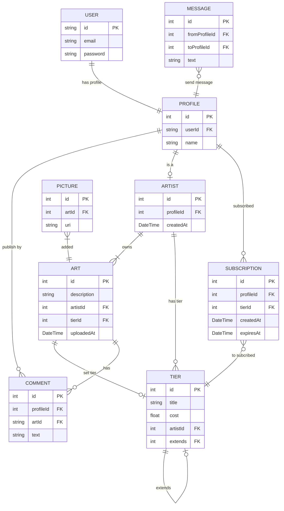

# Neospiartion

  

Neospiartion (ArtSite "кодовое имя") - это социальная сеть для художников, специализирующихся на создании digital-рисунков, где они могут публиковать свои работы.

  

## Планируемыый функционал

Функциональным назначением программы является соединение исполнителей (художников) и заказчиков.

К функциональному назначению относится:

-  [ ] размещение художниками оригинальных изображений в личном профиле;
    
-  [ ] установка художником уровней доступа (тиров) к своим работам по критерию размера оплаты;
    
-  [ ] публикация совместных (коллаборационных) работ нескольких художников одной записью;
    
-  [ ] связь в формате личных сообщений между пользователями;
    
-  [ ] загрузка пользователями своих работ с других площадок (ВК <...>);
    
-  [ ] отправление пользователями пожертвований (донатов) художников;
    
-  [ ] оформление заказов и требований к работам клиентами с последующей процедурой оплаты, устанавливаемой художником.

К функциональному назначению относится:

-  [ ] размещение художниками оригинальных изображений в личном профиле;
    
-  [ ] установка художником уровней доступа (тиров) к своим работам по критерию размера оплаты;
    
-  [ ] публикация совместных (коллаборационных) работ нескольких художников одной записью;
    
-  [ ] связь в формате личных сообщений между пользователями;
    
-  [ ] загрузка пользователями своих работ с других площадок (ВК <...>);
    
-  [ ] отправление пользователями пожертвований (донатов) художников;
    
-  [ ] оформление заказов и требований к работам клиентами с последующей процедурой оплаты, устанавливаемой художником.

  

## ER Диаграмма

  

## Команда

  

Ветров Дмитрий - Backend-программист, Frontend-программист

  

Кривецкий Артемий - Backend-программист

  

Светова Алиса - Frontend-программист, художник

  

## Краткое описание предметной области
Существует потребность в создании специализированной онлайн-платформы, которая объединит художников и их поклонников, предоставляя возможность для демонстрации творчества, монетизации работ и взаимодействия с аудиторией. Художники смогут публиковать свои работы, создавать подписки для поддержки со стороны пользователей, а также продавать свои произведения или услуги. Пользователи, в свою очередь, получат доступ к уникальному контенту, возможность поддержки любимых авторов и приобретения их работ.

Данное техническое задание определяет требования к разработке веб-платформы, ориентированной на художников и их аудиторию.

## Существующие аналоги

Среди аналогов можно отметить сайты Patreon, Boosty и ArtStation. Основными недостатками данных проектов являются:

1.  **Patreon** является иностранным сайтом, с отсутствием локализации на русский язык. Также не имеется возможности работы с картами российских банков.
    
2.  **ArtStation** — это зарубежная онлайн-платформа для художников, предпочтение в которой отдаётся тем художникам, чьи работы с наибольшей скоростью собирают большое количество одобрительных оценок и комментариев. Из-за этого новые пользователи чаще всего остаются незамеченными.
    
3.  **Boosty** является отечественной платформой и преподносит себя как аналог Patreon. Однако, по сравнению с Patreon, модерация контента там гораздо жёстче, из-за чего многие художники не могут публиковать свои работы, так как они не соответствуют политике пользования платформы.

Данный проект должен обладать следующими преимуществами перед существующими аналогами:

- [ ]  ориентация на аудиторию из России, что обеспечивает удобство использования, поддержку локальных платежных систем и адаптацию под потребности русскоязычных пользователей;
- [ ]  система рекомендаций, которая помогает художникам продвигать свои работы, а пользователям — находить новых авторов, соответствующих их интересам;    
- [ ]  возможность создания сообществ и взаимодействия между художниками и их поклонниками, что способствует развитию творческой среды.
