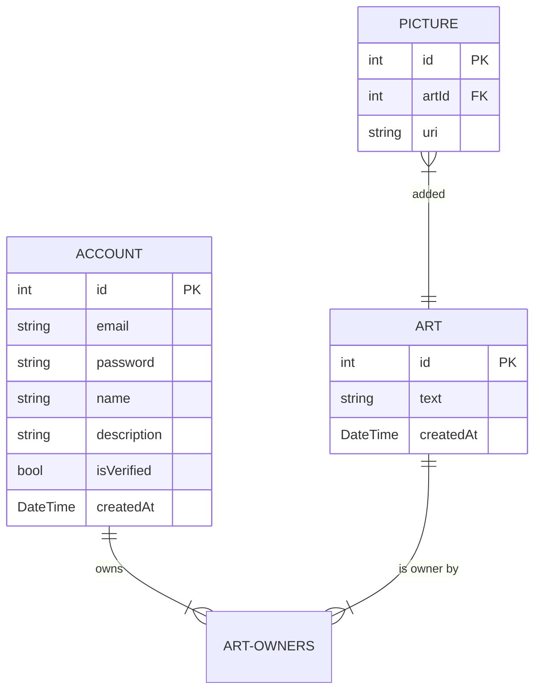

# Neospiartion

Neospiartion (ArtSite "кодовое имя") - это социальная сеть для художников, где люди могут публиковать свои работы.

## Функциональность

- [ ] Регестрировать аккаунты
- [ ] Загружать изображанения и опублкиовать их в качестве постов
- [ ] Создавать профиля художников
- [ ] Ставить пользователям отметки нравится на посты
- [ ] Заказывать у художников
- [ ] Возможность оставлять пожертвование
- [ ] Платные подписки (тиры), и посты в зависимости от подписок
- [ ] Совместные арты - один арт, но публикуются у несколько профилей
- [ ] Загрузков артов из других социальных сетей (ВК)

## Структура Базы Данных

## Команда

Ветров Дмитрий - Backend-программист, Frontend-программист

Кривецкий Артемий - Backend-программист

Алиса Светова - Frontend-программист, художник
